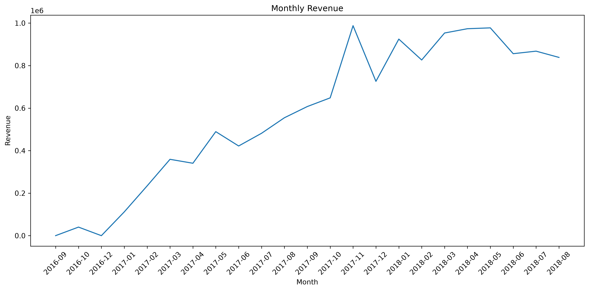
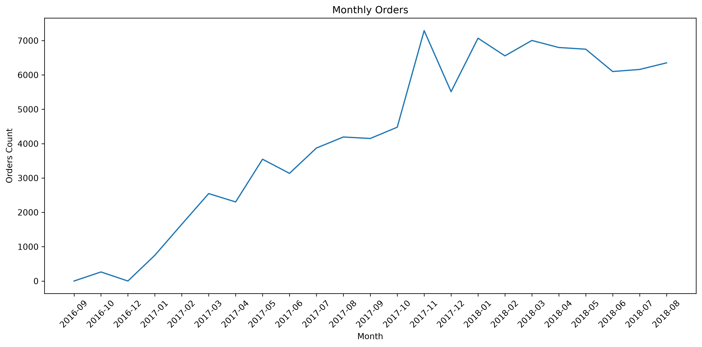

# Monthly Sales Analysis

Sales performance analysis project built with Python, Excel, and Power BI.

## Project Overview

This project analyzes monthly sales data from an e-commerce business to identify revenue trends and order volume over time.

The dashboard provides an interactive overview of key business metrics and monthly performance.

## Key Metrics

- **Total Revenue:** €13.22M
- **Total Orders:** 96K
- **Period:** September 2016 – August 2018

## Dashboard

### Monthly Revenue

### Monthly Orders

## Technologies

- Python
- Pandas
- Excel
- Power BI
- GitHub

## Project Files

- `monthly_sales_for_power_bi.csv` — dataset used in Power BI
- `analysis.py` — data analysis in Python
- `main.py` — project entry point
- `monthly_revenue.png` — revenue visualization
- `monthly_orders.png` — orders visualization

## Skills Demonstrated

- Data cleaning
- Data analysis with Pandas
- Data visualization
- Dashboard creation in Power BI
- GitHub project documentation
